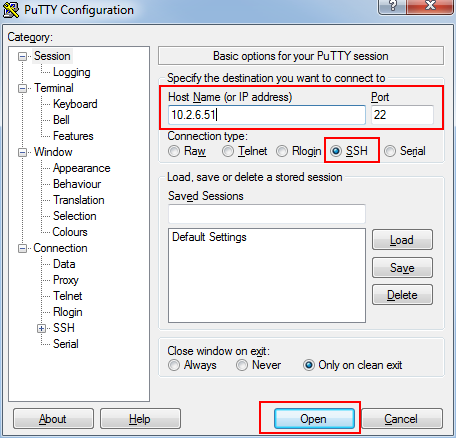

# Lab Setup 
On the provided Windows VM, download the GitHub repository. 
Go to the [repo](https://github.com/jruels/adv-ansible) in a browser, and in the top right corner, click the green "Code" button, then click "Download as zip". 
Once the download is done, extract the zip file to somewhere you can easily access it.


## Set up Putty

Download Putty from [here](https://the.earth.li/~sgtatham/putty/latest/w64/putty.exe) and save it to the VM desktop. 

Open Putty and configure a new session for each of the Ansible VMs.




Expand Connection -> SSH -> Auth -> Credentials, click "Browse", and then choose the `lab.ppk` file from the `adv-ansible/keys` directory


Remember to save your session. 

## Log into each node

Confirm you can connect to each Ansible VM assigned to you below using Putty.

The username for SSH is `ubuntu` 

| Student Number 	| Control server 	| Managed Node1   	| Managed Node2  	|
|----------------	|----------------	|-----------------	|----------------	|
| Student1 | 18.144.42.142 | 3.101.28.106 | 52.53.183.233 |
| Student2 | 54.183.223.188 | 3.101.73.176 | 54.177.213.182 |
| Student3 | 13.57.51.66 | 54.219.145.131 | 13.56.81.124 |
| Student4 | 54.183.66.155 | 54.183.121.204 | 54.215.253.172 |
| Student5 | 54.219.113.163 | 54.183.76.130 | 54.215.69.35 |
| Student6 | 13.57.51.193 | 54.183.232.72 | 13.57.234.199 |
| Student7 | 13.56.13.97 | 3.101.134.233 | 54.193.109.230 |
| Student8 | 54.215.102.1 | 54.215.65.42 | 13.57.217.70 |
| Student9 | 13.56.11.127 | 54.176.135.201 | 54.176.103.180 |


## Install Ansible on all the nodes

On each node, install Ansible using pip

```bash
sudo pip3 install ansible
```

Confirm ansible was installed successfully. 

```bash
ansible --version
```

You should see output similar to

```
ansible [core 2.13.13]
  config file = None
  configured module search path = ['/home/ubuntu/.ansible/plugins/modules', '/usr/share/ansible/plugins/modules']
  ansible python module location = /home/ubuntu/.local/lib/python3.8/site-packages/ansible
  ansible collection location = /home/ubuntu/.ansible/collections:/usr/share/ansible/collections
  executable location = /home/ubuntu/.local/bin/ansible
  python version = 3.8.10 (default, Nov 22 2023, 10:22:35) [GCC 9.4.0]
  jinja version = 3.1.3
  libyaml = True
```


## Configure the `ansible` user on all the nodes

Add a new `ansible` user to each node. This user will be used for running `ansible` tasks. 

On each node run:

```
sudo useradd -m -s /bin/bash ansible
```


## Configure `sudo` Access for the ansible user

Now, we'll configure sudo access for Ansible on `managed node1` and `managed node2` such that Ansible may use `sudo` for any command with no password prompt.

```
sudo visudo 
```

Add the following line to the file and save:

```
ansible    ALL=(ALL)       NOPASSWD: ALL 
```


## Configure SSH for ansible user

Configure the `ansible` user on the control node for SSH shared key access to the managed nodes.

**Note:** Do not use a passphrase for the key pair.

Create a key pair for the `ansible` user on the control host, accepting the defaults when prompted:

```
sudo su - ansible
ssh-keygen 
```


#### Copy the public key to both nodes provided by the instructor:

On the Control Node, copy the output of:

```
cat /home/ansible/.ssh/id_rsa.pub
```

## Log into the managed nodes 

Using Putty, log in to each of the managed nodes: 


Become the `ansible` user:

```
sudo su - ansible 
```

Use `ssh-keygen`, accepting defaults, to create the `.ssh` directory

```
ssh-keygen
```

Now create the `authorized_keys` file and paste the copied output from above into it.

```
echo "<output from cat command above>" > /home/ansible/.ssh/authorized_keys
```

Set the correct permissions

```
chmod 600 /home/ansible/.ssh/authorized_keys
```

## Connect from control node to managed nodes

Confirm you can ssh as the `ansible` user from the **control node** to the **managed nodes**.


## Create a Simple Ansible Inventory

Run the following on the **CONTROL SERVER**   
Create and enter a working directory

```
mkdir /home/ansible/lab-setup && cd /home/ansible/lab-setup
```

Next, we'll create a simple Ansible inventory on the control node in `/home/ansible/lab-setup/inventory` containing `node1` and `node2`.

On the control host:

Enter the working directory
```
cd /home/ansible/lab-setup
```
```
touch inventory 
echo "node1 ansible_host=<IP of node1>" >> inventory 
echo "node2 ansible_host=<IP of node2>" >> inventory 
```


## Verify Each Managed Node Is Accessible

Finally, we'll verify each managed node is able to be accessed by Ansible from the control node using the `ping` module.

Redirect the output of a successful command to `/home/ansible/lab-setup/output`.

To verify each node, run the following as the `ansible` user from the control host:

Enter the working directory:
```
cd /home/ansible/lab-setup
```

```
ansible -i inventory node1 -m ping 
ansible -i inventory node2 -m ping 
```

To redirect output of a successful command to `/home/ansible/lab-setup/output`:

```
ansible -i inventory node1 -m ping > output 
```

## Conclusion

Congratulations on completing this lab!
