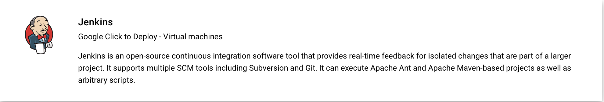
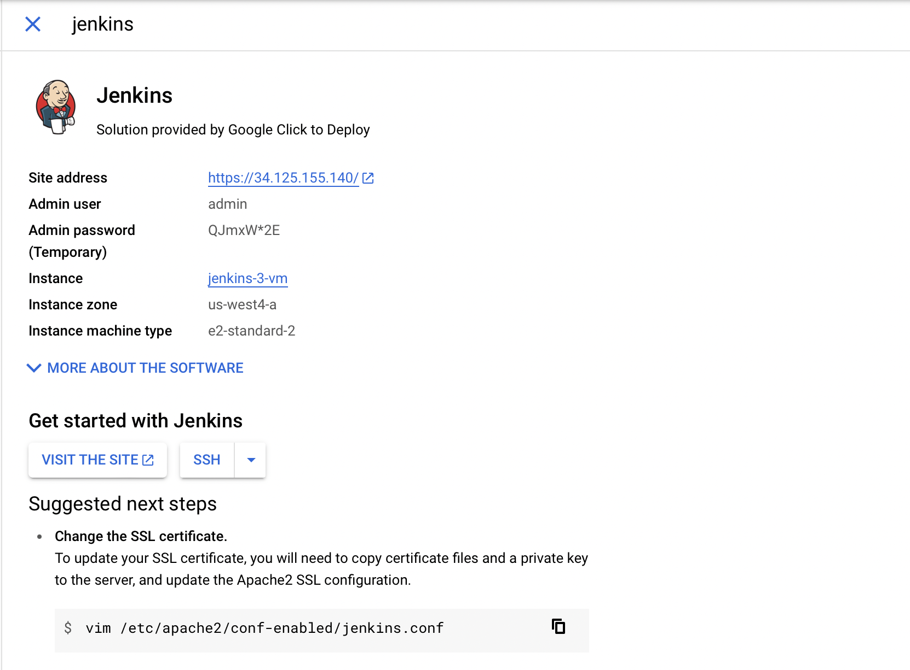

# Jenkins basics

# Install Jenkins 

This article shows how to install [Jenkins](https://jenkins.io) in a cloud environment.

In this article, you'll learn how to:

* Deploy a production ready Jenkins cluster
* Configure a sample Jenkins job based on a sample Java app in GitHub
* Build the sample Jenkins job

## 1. Login to the Portal
Log into the [Cloud Portal](https://console.cloud.google.com) using credentials provided by instructor.   

Select the project provided by the instructor   

Step 1:   

Step 2:   

Launch the Cloud Shell by clicking the terminal icon to the right of the search bar.   

## 2. Open Cloud Shell   
1. If you already have a Cloud Shell session open, you can skip to the next section.   
2. Open Cloud Shell.   
   

## 3. Launch the Jenkins cluster from the Marketplace   
Go to the [Marketplace](https://console.cloud.google.com/marketplace)   
In the searchbar at the top of the page type Jenkins   
Select the result with the tagline "Google Click to Deploy - Virtual machines" as shown in the screenshot   
   

On the new page click "Launch" and accept the default options.   

Click "Deploy" at the bottom of the page.   

After the deployment is complete you will see access information on the right side of the screen.    
   

Click "VISIT THE SITE" to load the login screen.   

Log in using the credentials provided on the Info page.   

On the left click "Manage Jenkins -> Manage Plugins"   

At the top of the screen choose "Available"   

Search for each of the following and select them when found.   

* GitHub Plugin
* Gradle Plugin

After selecting the two plugins choose "Install without restart"

## 4. Create your first job

On the Jenkins home page, select **Create a job**.

Enter a job name of `mySampleApp`, select **Freestyle project**, and select **OK**.
 

Select the **Source Code Management** tab. Enable **Git** and enter the following URL for the **Repository URL** value: `https://github.com/spring-guides/gs-spring-boot.git`. Then change the **Branch Specifier** to `*/main`.

Select the **Build** tab, then select **Add build step**

From the drop-down menu, select **Invoke Gradle script**.

Select **Use Gradle Wrapper**, then enter `complete` in **Wrapper location** and `build` for **Tasks**.

Select **Advanced** and enter `complete` in the **Root Build script** field.

Scroll to the bottom of the page, and select **Save**.

## 5. Build the sample Java app

When the home page for your project displays, select **Build Now** to compile the code and package the sample app.

A graphic below the **Build History** heading indicates that the job is being built.

  

When the build completes, select the **Workspace** link.

Navigate to `complete/build/libs` to see that the `.jar` file was successfully built.

 

You can also confirm the build was successful by viewing the console output. 

* Click the icon on the left of the build job ID
	

* The console output will show if the build was successful. 
	

Your Jenkins server is now ready to build your own projects!

## Congrats!
